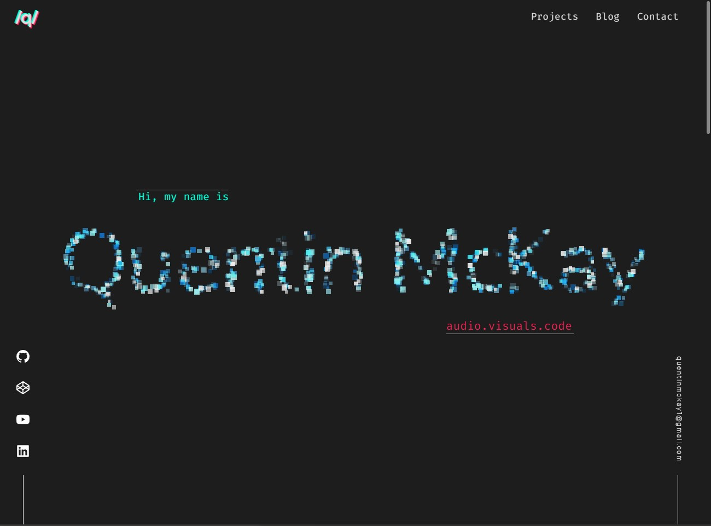
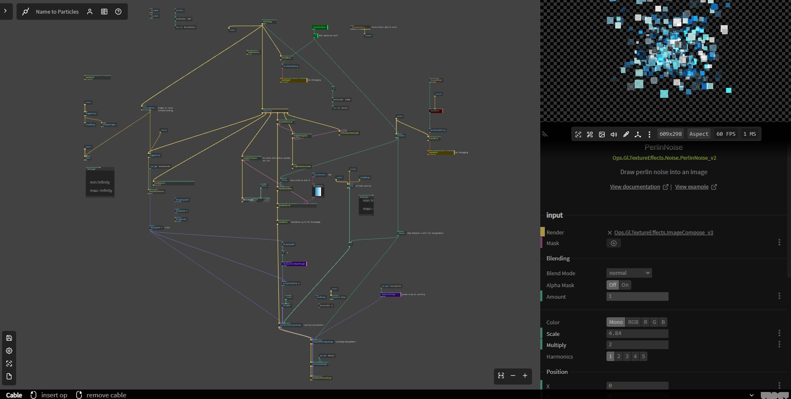

# Point Cloud Text Scroll

A point cloud text scroll effect created for my portfolio site. Created with [cables.gl](https://cables.gl).

Text texture is randomly sampled to create an array of points.  

Animation on page load drives interpolation between that array and 2nd array of random 3D points (which has a sine function with modulating phase applied). 

`window.pageYOffset` is then used to transform the viewmatrix in Y axis and drive interpolation to a 3rd array of random points (to spread them back out)

Point opacity is controlled by sampling a perlin noise texture (for the sparkle effect).

[Click here to view portfolio site](https://quentin-mckay-portfolio.netlify.app)

Note: `patch.js` is the JS file for embedding into a webpage. It's not meant to viewed raw.

[Click here to view original patch](https://cables.gl/p/55Ipxg). Right-click to reset 1st animation. Scroll down to drive the 2nd animation.

## Issues
1. Scrolling with a trackpad seems to freeze the animation until released. Not sure why.
2. Performs very poorly on less powerful machines and I haven't implemented any accomodation or fallback for that scenario.